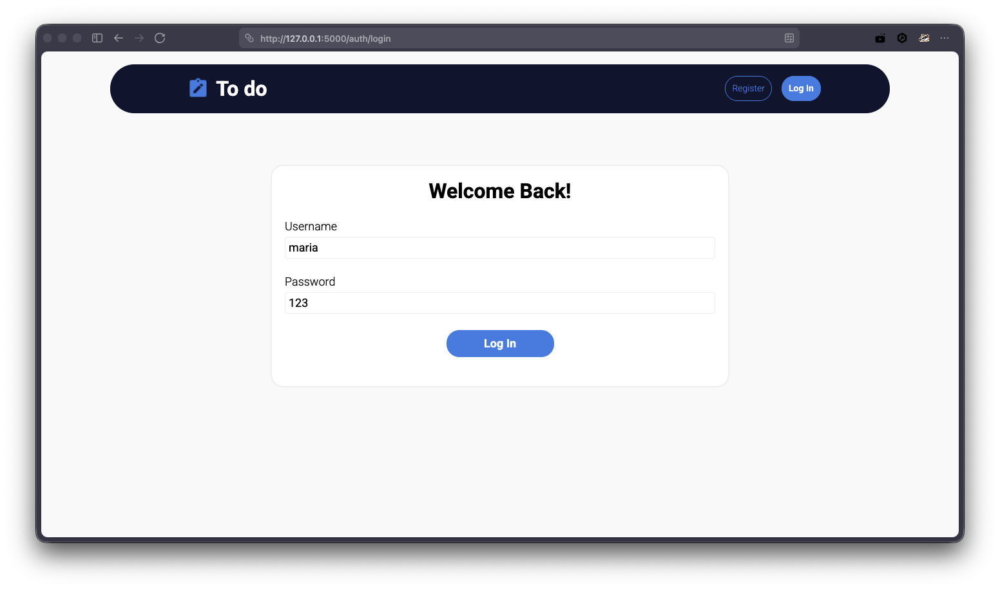
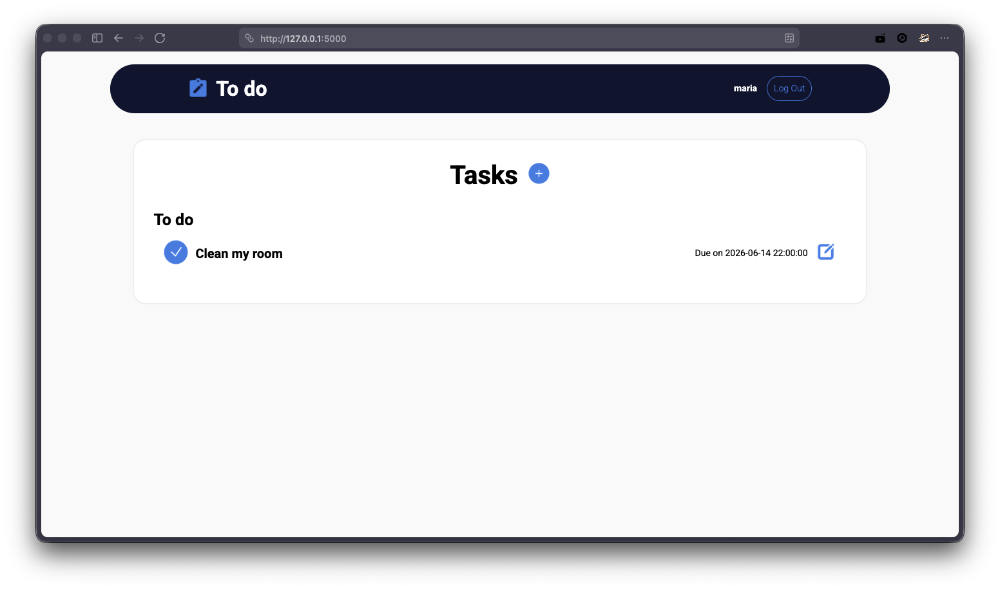
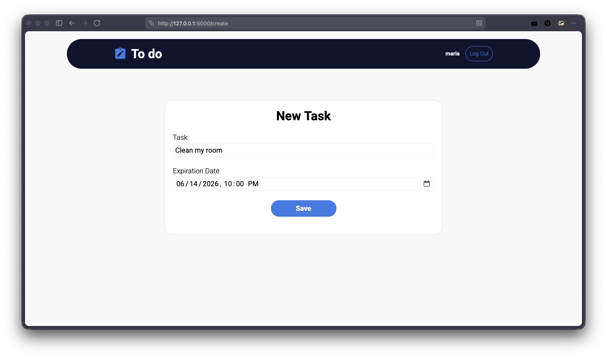
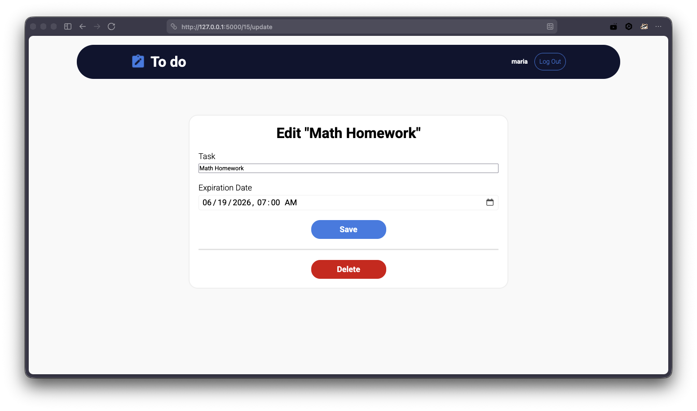
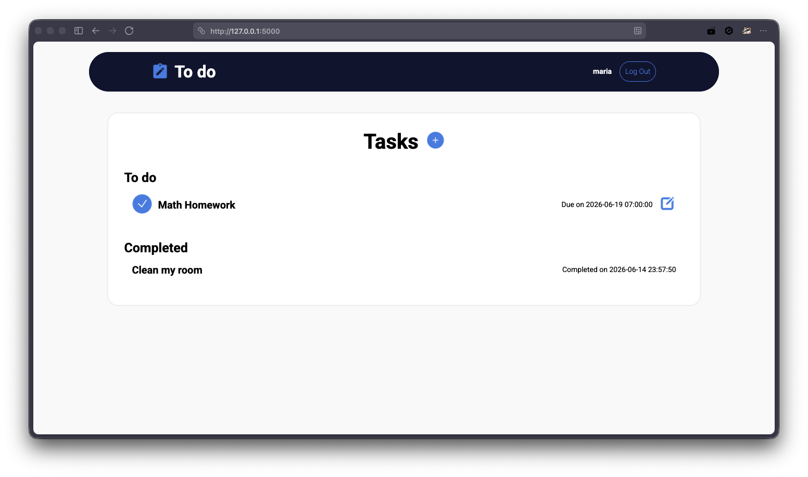

# Flask Todo App

A web-based Todo application built with Python and Flask. It allows users to register, log in, create and manage tasks, set expiration dates, and mark tasks as completed with an automatic completion timestamp. Data is stored locally using SQLite so tasks persist between sessions and remain associated with each user account.

## Prerequisites

Before running the project, make sure you have:

- Python 3.10 or newer installed
- pip installed

To check your Python version:

```bash
python --version
```

## Installation

Clone the repository:

```bash
git clone https://github.com/jorgevldzs/flask-todo-app.git
cd flask-todo-app
```

Create a virtual environment:

### Windows

```bash
python -m venv .venv
.venv\Scripts\activate
```

### macOS / Linux

```bash
python3 -m venv .venv
source .venv/bin/activate
```

Install dependencies:

```bash
pip install -r requirements.txt
```

Initialize the database:

```bash
flask --app todo init-db
```

## How to run the application

Start the Flask development server:

```bash
flask --app todo run --debug
```

Open your browser and visit:

```text
http://127.0.0.1:5000
```

## Screenshot showing the sample use of the application

### Login Page




### Dashboard




### Create Task




### Edit Task




### Completed Tasks




## Features

- User authentication (register, login, logout)
- Create tasks
- Edit tasks
- Delete tasks
- Set expiration dates
- Mark tasks as completed
- Store data using SQLite
- User-specific task management
- Clean interface

## Technologies Used

- Python
- Flask
- Jinja2
- SQLite
- HTML
- CSS

## Project Structure

```text
todo/
│
├── auth.py
├── db.py
├── todo.py
├── templates/
├── static/
├── schema.sql
└── __init__.py
```


## Author

**Jorge Valdez**

GitHub: https://github.com/jorgevldzs